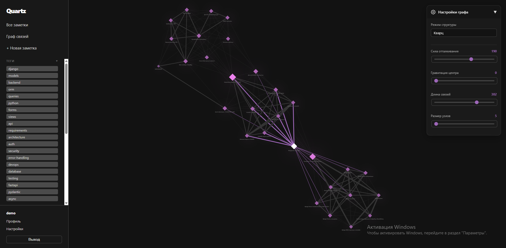

<div align="center">
  <pre style="color: #fa8bce; background-color: #252124; padding: 25px; border-radius: 500px; font-weight: bold; display: inline-block; text-align: left;">
________                       __          
\_____  \  __ _______ ________/  |_________
 /  / \  \|  |  \__  \\_  __ \   __\___   /
/   \_/.  \  |  // /_ \|  | \/|  |  /  __/ 
\_____\ \_/____/(____  /__|   |__| /_____ \
       \__>          \/                  \/
  </pre>
</div>

<p align="center">
    Система управления базой знаний на базе искусственного интеллекта.
</p>

<p align="center">
    
    
    
</p>

<p align="center">
    <a href="#технический-стек">Технический стек</a> •
    <a href="#установка-и-запуск">Установка и запуск</a> •
    <a href="#архитектура">Архитектура</a>
</p>



---

## Идея

Quartz — это веб-приложение для создания и организации личных заметок. Уникальность проекта в том, что при сохранении каждой заметки запускается анализ с помощью ИИ, который:

- автоматически генерирует релевантные теги (анализирует содержание, переиспользует существующие);
- строит графовые связи между заметками на основе общих тегов;
- поддерживает несколько провайдеров: OpenAI, Google Gemini, Claude (через OpenRouter), локальные модели (Ollama).

Приложение помогает быстро организовать информацию и находить релевантные связи между идеями.

---

## Цели проекта

- Практика Django 6.x: модели, views, формы, AJAX, шаблоны.
- Интеграция с современными ИИ-сервисами (OpenAI API, Google Generative AI и др.).
- Создание красивого, удобного интерфейса с тёмной темой.
- Реализация граф-ориентированной системы связей между данными.
- Работа с GitHub и построение истории коммитов.
- Демонстрация навыков: backend, frontend, API-интеграция.

---

## Функциональность

### Базовый функционал (Must‑Have)

| Функция | Описание | Статус |
|---------|----------|--------|
| Регистрация и авторизация | Система учёта пользователей с использованием встроенной Django auth | Готово |
| CRUD для заметок | Создание, чтение, редактирование, удаление заметок | Готово |
| Главная страница | Таблица всех заметок пользователя с сортировкой | Готово |
| Детальная страница | Просмотр полной информации о заметке с Markdown-рендером | Готово |
| Поиск | Полнотекстовый поиск по названию и содержимому | Готово |
| Фильтрация | Фильтрация заметок по тегам | Готово |
| Минимальная стилизация | Современный dark-mode интерфейс с чистым дизайном | Готово |

### Бонусные возможности (Челленж-функции)

| Функция | Описание | Статус |
|---------|----------|--------|
| Просмотры | Счётчик просмотров с защитой от множественного подсчёта (сессии) | Готово |
| Динамическая генерация тегов | ИИ анализирует заметку и автоматически создаёт теги | Готово |
| Граф связей | Интерактивная визуализация зависимостей заметок (Vis.js) | Готово |
| Поддержка ИИ-провайдеров | OpenAI, Google Gemini, Claude (OpenRouter), Ollama | Готово |
| Управление API-ключами | Страница настроек для хранения и управления ключами | Готово |
| Экспорт в Markdown | Скачивание заметок в .md формате | Готово |
| Расширенный Markdown | Полная поддержка Markdown-синтаксиса в заметках | Готово |
| Боковая панель | Быстрый доступ к тегам, дереву заметок, профилю | Готово |

---

## Технический стек

```
Backend:
├── Django 6.0.7        — веб-фреймворк
├── Python 3.10+        — язык программирования
├── SQLite              — база данных
└── openai~=2.47.0      — SDK для работы с ИИ API

Frontend:
├── HTML5 + CSS3        — вёрстка и стилизация
├── Vanilla JavaScript  — интерактивность
├── Vis.js              — граф-визуализация
└── markdown2~=2.5.5    — рендеринг Markdown

DevOps:
├── Git / GitHub        — версионирование
├── Python virtualenv   — изоляция зависимостей
└── Pillow~=12.3.0      — обработка изображений (готово к расширению)
```

---

## Требования

- Python 3.10 или выше
- pip для управления пакетами
- Git для версионирования

---

## Установка и запуск

### 1. Клонирование репозитория

```bash
git clone https://github.com/Ouroborn/Quartz.git
cd Quartz
```

### 2. Создание виртуального окружения

```bash
# На Windows
python -m venv .venv
.venv\Scripts\activate

# На macOS/Linux
python3 -m venv .venv
source .venv/bin/activate
```

### 3. Установка зависимостей

```bash
pip install -r requirements.txt
```

### 4. Применение миграций БД

```bash
python manage.py migrate
```

### 5. Создание суперпользователя (для админ-панели)

```bash
python manage.py createsuperuser
```

### 6. Запуск сервера разработки

```bash
python manage.py runserver
```

Приложение будет доступно по адресу: `http://127.0.0.1:8000`

---

## Настройка ИИ-провайдеров

Для использования автоматической генерации тегов:

### OpenAI

1. Получите ключ на https://platform.openai.com/api-keys
2. На странице **Настройки** выберите провайдера `OpenAI`
3. Введите ваш API ключ
4. Выберите модель (например, `gpt-4o-mini`)

### Google Gemini

1. Получите ключ на https://aistudio.google.com/app/apikeys
2. На странице **Настройки** выберите `Google Gemini`
3. Введите ключ и выберите модель

### Claude (через OpenRouter)

1. Зарегистрируйтесь на https://openrouter.ai/
2. Получите API ключ в настройках
3. На странице **Настройки** выберите `Anthropic (через OpenRouter)`
4. Введите ключ и выберите модель Claude

### Локальная модель (Ollama)

1. Установите [Ollama](https://ollama.ai/)
2. Запустите модель: `ollama run mistral` (или другую)
3. На странице **Настройки** выберите `Локальная модель (Ollama)`
4. Ключ вводить не нужно (будет использован `ollama` по умолчанию)

---

## Использование

### Создание заметки

1. Нажмите **"+ Новая заметка"** в боковой панели.
2. Введите заголовок и содержимое (поддерживается Markdown).
3. Добавьте или создайте теги.
4. Нажмите **"Сохранить"**.
5. ИИ автоматически проанализирует заметку и создаст связи с другими.

### Поиск и фильтрация

- **Быстрый поиск** — вверху на главной странице (ищет в названиях и содержимом).
- **Фильтрация по тегам** — клик на тег в боковой панели или в таблице.
- **Интерактивная таблица** — кликните на заголовок столбца для сортировки.

### Просмотр графа связей

1. Нажмите **"Граф связей"** в боковой панели.
2. Узлы (кружки) — это ваши заметки.
3. Рёбра (линии) — связи на основе общих тегов.
4. Толщина линии пропорциональна количеству общих тегов.
5. Клик по узлу переведёт к соответствующей заметке.

### Управление ИИ-провайдерами

1. Перейдите в **"Настройки"**.
2. Выберите провайдера и введите API ключ.
3. Выберите модель (список подгружается автоматически).
4. Сохраните — теперь новые заметки будут анализироваться выбранным провайдером.

---

## Архитектура

### Модели данных

```python
User (Django встроенная)
├── UserSettings (API ключи, выбранный провайдер)
├── Note (заметка пользователя)
│   ├── title: str
│   ├── content: str (Markdown)
│   ├── created_at, updated_at: datetime
│   ├── views_count: int
│   └── tags: ManyToMany[Tag]
│
├── Tag (категория для группировки)
│   └── name: str (unique)
│
└── NoteRelation (граф связей)
    ├── source, target: ForeignKey[Note]
    ├── reason: str
    └── weight: float
```

### Views и URL-маршруты

| URL | Метод | Описание |
|-----|-------|----------|
| `/` | GET | Главная страница со всеми заметками |
| `/signup/` | GET, POST | Регистрация |
| `/notes/create/` | GET, POST | Создание заметки |
| `/notes/<id>/` | GET | Просмотр заметки |
| `/notes/<id>/edit/` | GET, POST | Редактирование |
| `/notes/<id>/delete/` | GET, POST | Удаление |
| `/notes/<id>/export/` | GET | Скачать в .md |
| `/settings/` | GET, POST | Управление ИИ-провайдерами |
| `/graph/` | GET | Визуализация графа |
| `/graph/data/` | GET | JSON-данные для графа |

### Поток анализа заметки (ИИ)

```
Пользователь создаёт заметку
        ↓
Django сохраняет в БД
        ↓
Вызывается run_ai_analysis(note)
        ↓
Генерируются теги (ИИ или fallback)
        ↓
Теги привязываются к заметке
        ↓
Ищутся связи с другими заметками (общие теги)
        ↓
Создаются NoteRelation записи
        ↓
Пользователь видит заметку с автотегами и новыми связями в графе
```

---

## Структура проекта

```
Quartz/
├── config/                 # Django конфигурация
│   ├── settings.py        # Настройки проекта
│   ├── urls.py            # Главный маршрутизатор
│   ├── asgi.py, wsgi.py   # Entry points
│
├── notes/                  # Основное приложение
│   ├── models.py          # ORM модели (Note, Tag, NoteRelation, UserSettings)
│   ├── views.py           # Обработчики запросов
│   ├── forms.py           # Django формы (NoteForm, UserSettingsForm)
│   ├── ai_services.py     # Логика работы с ИИ (OpenAI SDK, провайдеры)
│   ├── urls.py            # Маршруты приложения
│   ├── admin.py           # Django админ-панель
│   ├── apps.py            # Конфигурация приложения
│   │
│   ├── templates/         # HTML шаблоны
│   │   ├── base.html      # Базовая вёрстка (боковая панель, макет)
│   │   ├── notes/
│   │   │   ├── index.html          # Таблица заметок
│   │   │   ├── note_detail.html    # Просмотр заметки
│   │   │   ├── note_form.html      # Форма создания/редактирования
│   │   │   ├── note_confirm_delete.html  # Подтверждение удаления
│   │   │   ├── settings.html       # Настройки ИИ
│   │   │   └── graph.html          # Интерактивный граф (Vis.js)
│   │   │
│   │   └── registration/
│   │       ├── login.html          # Вход
│   │       └── signup.html         # Регистрация
│   │
│   ├── static/            # CSS, JS, изображения
│   └── migrations/        # История изменений БД
│
├── media/                 # Загруженные файлы (готово к расширению)
├── db.sqlite3            # База данных SQLite
├── manage.py             # Django управление
├── requirements.txt      # Зависимости Python
├── .gitignore            # Исключения из Git
└── README.md             # Этот файл
```

---

## Разработка

### Запуск в режиме debug

```bash
# Уже включено по умолчанию в settings.py
DEBUG = True
```

### Работа с базой данных

```bash
# Создание миграции после изменения моделей
python manage.py makemigrations

# Применение миграций
python manage.py migrate

# Просмотр SQL запросов конкретной миграции
python manage.py sqlmigrate notes 0001
```

### Админ-панель

1. Запустите сервер.
2. Перейдите на `/admin`.
3. Введите учётные данные суперпользователя.
4. Управляйте: пользователями, заметками, тегами, связями.

### Добавление новой ИИ-модели

В `ai_services.py` добавьте конфиг в `PROVIDER_CONFIG`:

```python
PROVIDER_CONFIG = {
    "my_provider": {
        "base_url": "https://api.example.com/v1",
        "default_key": None,
        "model_filter": lambda m: m.startswith("my-model"),
    },
}
```

---

## Особенности интерфейса

- Тёмная тема с цветовой схемой (фиолетовый акцент).
- Адаптивный дизайн (готов к мобильным устройствам).
- Vanilla JavaScript без фреймворков (лёгкий, быстрый).
- Интерактивный граф с физическим движком (Vis.js).
- Таблица со смарт-сортировкой (текст, даты, числа).
- Динамический список тегов в боковой панели.

---

## Примеры использования

### Пример 1: Учебный процесс

1. Создаёте заметку "Основы Django моделей".
2. ИИ генерирует теги: ["django", "модели", "orm", "backend"].
3. В графе видна связь с заметкой "ORM запросы" (общие теги).
4. Можно быстро перейти между связанными темами.

### Пример 2: Управление проектом

1. Заметка "Требования к API".
2. Теги: ["api", "backend", "rest", "design"].
3. Автоматически связывает с "Authentication" и "Error Handling".
4. Граф показывает архитектуру проекта.

### Пример 3: Личные исследования

1. Изучаете новую технологию (например, WebAssembly).
2. Создаёте несколько заметок с примерами кода.
3. ИИ связывает их в граф по релевантности.
4. Быстро находите все связанные материалы.

---

## Известные ограничения

- **CSRF Protection**: все формы отправляются через Django POST с CSRF токеном.
- **API Rate Limits**: зависят от выбранного ИИ-провайдера (OpenAI, Gemini и др.).
- **SQLite для production**: в production рекомендуется PostgreSQL.
- **Отсутствие шифрования API ключей**: ключи хранятся в открытом виде (в production используйте переменные окружения).

---

## Используемые технологии в деталях

### Django 6.0.7

- Миграции — управление схемой БД.
- ORM — объектно-реляционное отображение.
- Middleware — обработка запросов.
- Template Engine — рендеринг HTML.
- Forms — валидация данных.
- Admin Interface — управление данными.

### OpenAI SDK

Используется единая интеграция через `openai.OpenAI()` с поддержкой:

- OpenAI endpoints (gpt-4, gpt-3.5-turbo и др.)
- Google Generative AI (через совместимый proxy)
- OpenRouter для Claude и других моделей
- Локальные модели через Ollama

### Vis.js

Мощная библиотека для визуализации графов:

- 20 000+ узлов без потери производительности.
- Физический движок для естественного расположения.
- Интерактивные жесты (drag, zoom, pan).
- Кастомизируемый стиль узлов и рёбер.

---

## Лицензия

Проект использует **MIT License** — свободен для использования в личных и коммерческих целях.

---

## Автор

**Ouroborn** — разработчик и энтузиаст AI-интеграций в веб-приложениях.

- GitHub: [@Ouroborn](https://github.com/Ouroborn)
- Проект: [Quartz](https://github.com/Ouroborn/Quartz)
